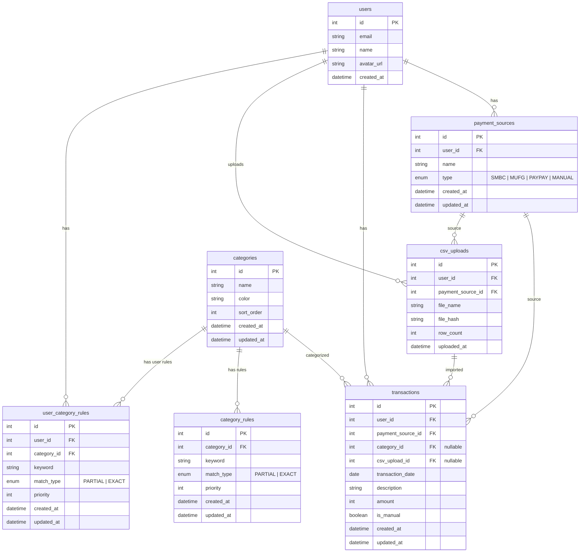
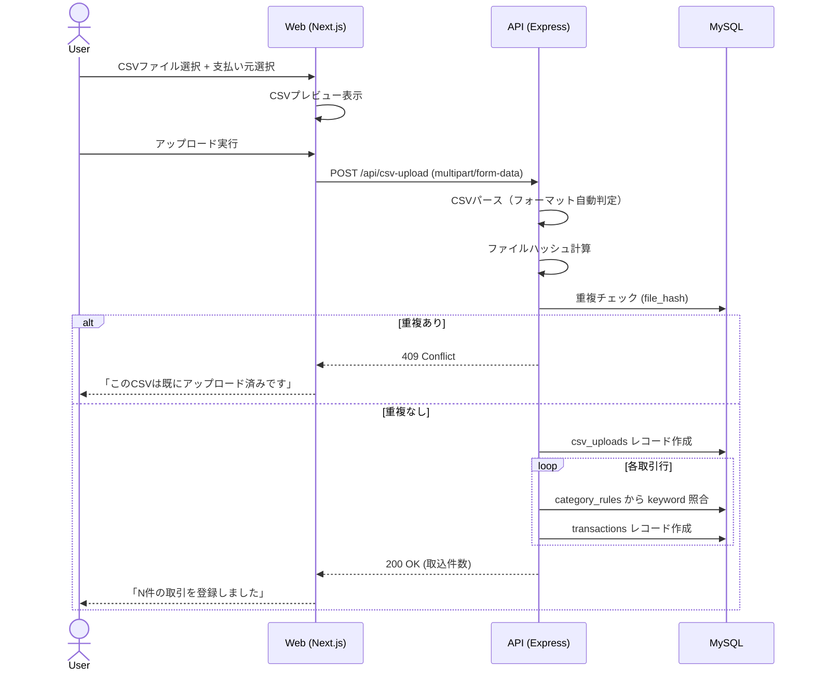
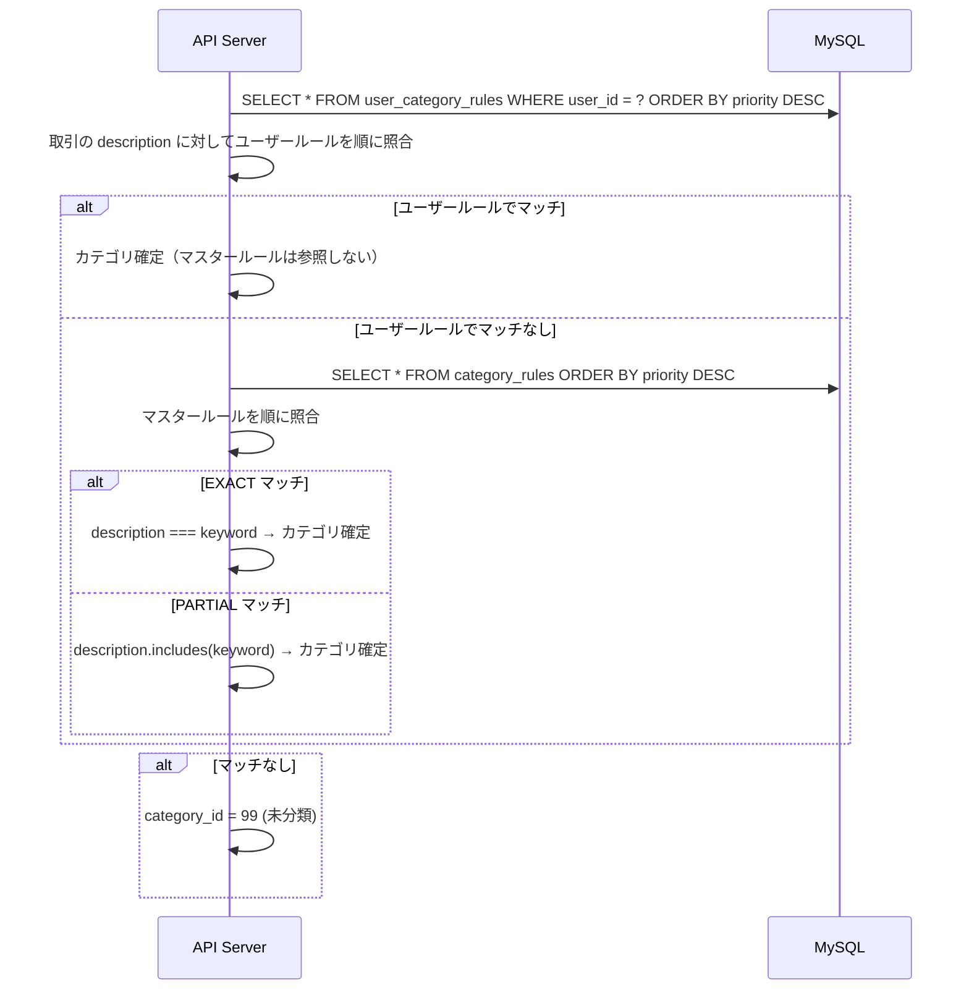
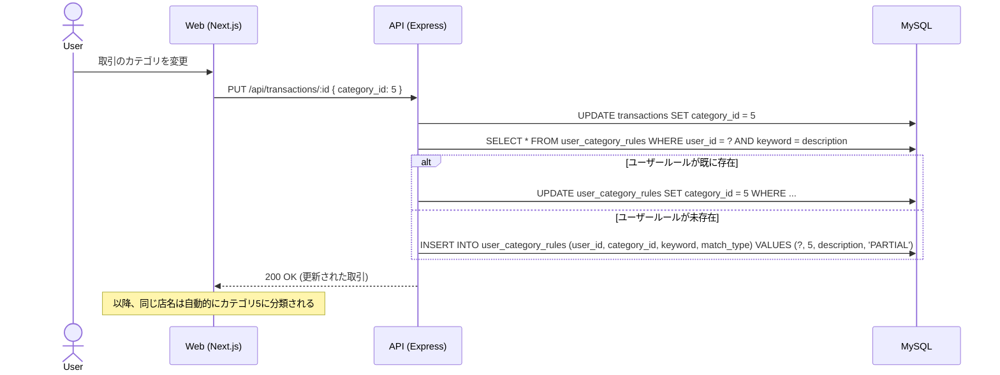
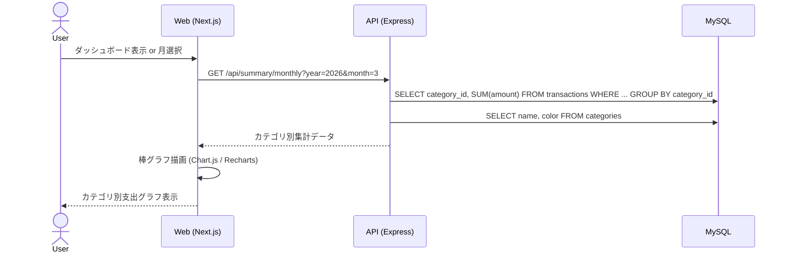
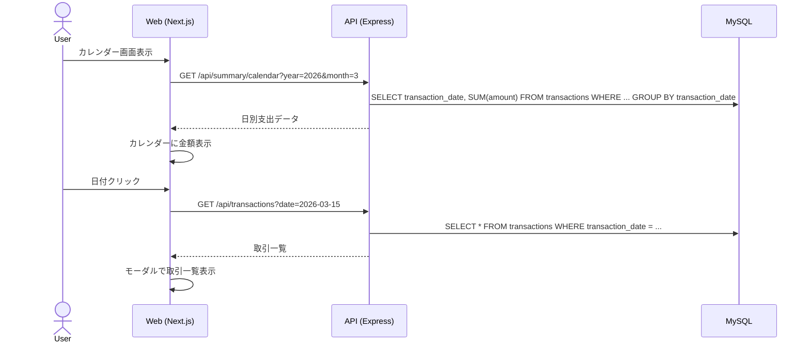

# Money Management - 仕様書・設計書

## 概要

ユーザーが複数の決済手段（ゆうちょ、SMBC、MUFG、PayPay等）のCSV明細をアップロードし、支出をカレンダー表示・カテゴリ別集計・折れ線グラフで可視化するWebアプリケーション。

---

## 仕様

### 認証
- GoogleアカウントによるOAuth 2.0ログイン（既存の認証基盤を利用）
- ユーザーごとにデータが分離される

### CSVアップロード
- 対応フォーマット: SMBC（三井住友カード）、MUFG（三菱UFJ）、PayPay
- CSVアップロード時に自動で支払い元（PaymentSource）を判定
- 同一CSVの二重取り込み防止（ハッシュによる重複チェック）
- アップロード履歴の管理

### 取引データ管理
- CSVからインポートされた取引データの一覧表示
- ユーザーによる手動での取引登録・編集・削除
- 取引ごとに日付・支払先・金額・カテゴリ・支払い元を保持

### 自動カテゴリ分類
- 支払先名からカテゴリを自動判定するルールベースの仕組み
- ルールは部分一致で照合（例: 「クリニック」を含む → 美容/医療）
- ルールには **マスタールール**（`category_rules` テーブル、全ユーザー共通）と **ユーザールール**（`user_category_rules` テーブル、ユーザー個別）の2種類がある
- 分類の優先順位: **ユーザールール > マスタールール** （ユーザールールにマッチすればマスタールールは参照しない）
- ルールに該当しない場合は「未分類」とする
- ユーザーは取引のカテゴリを手動で変更可能
- **取引のカテゴリを手動変更した場合、その支払先名（description）で自動的にユーザー固有の分類ルールが作成される**（同じ支払先名のルールが既にある場合は更新）
- これにより、以降のCSVインポートや手動登録時に同じ店名が自動で変更後のカテゴリに分類される

### カレンダー表示
- 月単位のカレンダーに日別の支出合計を表示
- 日付をクリックするとその日の取引一覧を表示

### グラフ・集計
- カテゴリ別の月間支出を棒グラフで表示
- 全カテゴリの月別推移を折れ線グラフで表示（過去12ヶ月）
- 月間の合計支出額を表示

### ユーザー側グルーピング管理（Web）
- カテゴリマスターの追加・編集・削除
- ユーザー固有の自動分類ルールの追加・編集・削除
- 取引のカテゴリ変更時に自動的にユーザールールが作成・更新される

### 管理画面（Admin）
- カテゴリマスターの追加・編集・削除
- マスター自動分類ルール（CategoryRule）の追加・編集・削除
- ルールのプレビュー（適用対象の取引を確認）

---

## 必要なDB設計

### 新規テーブル

| テーブル名 | 説明 | 主要カラム |
|---|---|---|
| `payment_sources` | 支払い元マスター | id, user_id, name, type(SMBC/MUFG/PAYPAY/MANUAL), created_at |
| `categories` | カテゴリマスター | id, name, color, sort_order, created_at |
| `category_rules` | 自動分類ルール（マスター） | id, category_id, keyword, match_type(PARTIAL/EXACT), priority, created_at |
| `user_category_rules` | ユーザー個別分類ルール | id, user_id, category_id, keyword, match_type(PARTIAL/EXACT), priority, created_at |
| `csv_uploads` | CSVアップロード履歴 | id, user_id, payment_source_id, file_name, file_hash, row_count, uploaded_at |
| `transactions` | 取引データ | id, user_id, payment_source_id, category_id, transaction_date, description, amount, is_manual, csv_upload_id, created_at |

### ER図（Mermaid）



### カテゴリ初期データ

| ID | name | color |
|---|---|---|
| 1 | 飲食 | #FF6384 |
| 2 | 交通 | #36A2EB |
| 3 | 美容・医療 | #FFCE56 |
| 4 | 日用品 | #4BC0C0 |
| 5 | ショッピング | #9966FF |
| 6 | エンタメ | #FF9F40 |
| 7 | 通信・サブスク | #C9CBCF |
| 8 | 光熱費 | #7BC8A4 |
| 9 | 住居 | #E7E9ED |
| 10 | 送金・その他 | #8B8D91 |
| 99 | 未分類 | #CCCCCC |

### 自動分類ルール初期データ

| keyword | match_type | category |
|---|---|---|
| スターバックス | PARTIAL | 飲食 |
| サンマルクカフェ | PARTIAL | 飲食 |
| マクドナルド | PARTIAL | 飲食 |
| セブン-イレブン | PARTIAL | 飲食 |
| まいばすけっと | PARTIAL | 飲食 |
| ピーコックストア | PARTIAL | 飲食 |
| 鳥貴族 | PARTIAL | 飲食 |
| ワンカルビ | PARTIAL | 飲食 |
| ふたご | PARTIAL | 飲食 |
| カラオケ館 | PARTIAL | エンタメ |
| Suica | PARTIAL | 交通 |
| タクシー | PARTIAL | 交通 |
| クリニック | PARTIAL | 美容・医療 |
| 医療法人 | PARTIAL | 美容・医療 |
| OCEAN TOKYO | PARTIAL | 美容・医療 |
| メイクマン | PARTIAL | 美容・医療 |
| ユニクロ | PARTIAL | ショッピング |
| ZOZOTOWN | PARTIAL | ショッピング |
| AMAZON | PARTIAL | ショッピング |
| Amazon | PARTIAL | ショッピング |
| ケーズデンキ | PARTIAL | ショッピング |
| アイハーブ | PARTIAL | ショッピング |
| APPLE COM BILL | PARTIAL | 通信・サブスク |
| APPLE.COM/BILL | PARTIAL | 通信・サブスク |
| CLAUDE.AI | PARTIAL | 通信・サブスク |
| Amazonプライム | PARTIAL | 通信・サブスク |
| AWS | PARTIAL | 通信・サブスク |
| 東京ガス | PARTIAL | 光熱費 |
| ChargeSpot | PARTIAL | 日用品 |
| ヤマト運輸 | PARTIAL | 日用品 |
| HAKADORU | PARTIAL | エンタメ |
| 送った金額 | PARTIAL | 送金・その他 |
| チャージ | EXACT | 送金・その他 |

---

## 必要なAPI

### 認証（既存）

| メソッド | パス | 説明 |
|---|---|---|
| GET | `/api/auth/google` | Google OAuth開始 |
| GET | `/api/auth/google/callback` | OAuthコールバック |
| GET | `/api/auth/me` | ログインユーザー情報取得 |

### カテゴリ

| メソッド | パス | 説明 |
|---|---|---|
| GET | `/api/categories` | カテゴリ一覧取得 |
| POST | `/api/categories` | カテゴリ作成 |
| PUT | `/api/categories/:id` | カテゴリ更新 |
| DELETE | `/api/categories/:id` | カテゴリ削除 |

### 自動分類ルール（マスター）

| メソッド | パス | 説明 |
|---|---|---|
| GET | `/api/category-rules` | マスタールール一覧取得 |
| POST | `/api/category-rules` | マスタールール作成 |
| PUT | `/api/category-rules/:id` | マスタールール更新 |
| DELETE | `/api/category-rules/:id` | マスタールール削除 |

### ユーザー個別分類ルール

| メソッド | パス | 説明 |
|---|---|---|
| GET | `/api/user-category-rules` | ユーザールール一覧取得 |
| POST | `/api/user-category-rules` | ユーザールール作成 |
| PUT | `/api/user-category-rules/:id` | ユーザールール更新 |
| DELETE | `/api/user-category-rules/:id` | ユーザールール削除 |

### 支払い元

| メソッド | パス | 説明 |
|---|---|---|
| GET | `/api/payment-sources` | ユーザーの支払い元一覧 |
| POST | `/api/payment-sources` | 支払い元作成 |
| DELETE | `/api/payment-sources/:id` | 支払い元削除 |

### CSVアップロード

| メソッド | パス | 説明 |
|---|---|---|
| POST | `/api/csv-upload` | CSVファイルアップロード・パース・取引登録 |
| GET | `/api/csv-uploads` | アップロード履歴一覧 |

### 取引

| メソッド | パス | 説明 |
|---|---|---|
| GET | `/api/transactions` | 取引一覧（フィルタ: 年月, カテゴリ, 支払い元） |
| POST | `/api/transactions` | 手動取引登録 |
| PUT | `/api/transactions/:id` | 取引更新（カテゴリ変更等） |
| DELETE | `/api/transactions/:id` | 取引削除 |

### 集計

| メソッド | パス | 説明 |
|---|---|---|
| GET | `/api/summary/monthly?year=2026&month=3` | 月間カテゴリ別集計 |
| GET | `/api/summary/calendar?year=2026&month=3` | カレンダー用日別集計 |
| GET | `/api/summary/trend?months=12` | カテゴリ別月次推移（折れ線グラフ用） |

---

## 必要な画面

### Web（apps/web）

| 画面 | パス | 説明 |
|---|---|---|
| ログイン | `/signin` | Googleログインボタン |
| OAuthコールバック | `/callback` | Google認証後のトークン保存・リダイレクト |
| ダッシュボード | `/` | 月間合計・カテゴリ別棒グラフ・最近の取引 |
| カレンダー | `/calendar` | 月カレンダー + 日別支出額 + 日付クリックで取引一覧モーダル |
| グルーピング | `/grouping` | カテゴリ追加・編集・削除 + 自動分類ルール管理 |
| グラフ | `/charts` | カテゴリ別月次推移（折れ線グラフ） |
| CSVアップロード | `/upload` | CSV選択 + 支払い元選択 + プレビュー + アップロード |
| 取引一覧 | `/transactions` | 取引一覧テーブル + フィルタ + 手動登録フォーム |
| 支払い元管理 | `/payment-sources` | 支払い元の追加・削除 |

#### サイドバーメニュー構成

```
📊 ダッシュボード     /
📅 カレンダー        /calendar
📁 グルーピング      /grouping
📈 グラフ           /charts
📤 CSVアップロード    /upload
💳 取引一覧         /transactions
💳 支払い元管理      /payment-sources
```

### Admin（apps/admin）

| 画面 | パス | 説明 |
|---|---|---|
| カテゴリ管理 | `/categories` | カテゴリCRUDテーブル |
| 分類ルール管理 | `/category-rules` | ルールCRUDテーブル + ルールプレビュー |

---

## フロー図

### CSVアップロードフロー



### 自動カテゴリ分類フロー



### 取引カテゴリ変更 → ユーザールール自動作成フロー



### 月間集計フロー



### カレンダー表示フロー



---

## 注意事項

### セキュリティ
- CSVアップロードは認証済みユーザーのみ許可
- ユーザーは自分のデータのみアクセス可能（全APIでuser_idフィルタ必須）
- CSVファイルサイズ上限: 10MB
- CSVの内容をサニタイズ（XSS対策）
- Admin画面は管理者権限チェック

### パフォーマンス
- transactionsテーブルに `(user_id, transaction_date)` の複合インデックス
- transactionsテーブルに `(user_id, category_id, transaction_date)` の複合インデックス
- 集計APIはDBのGROUP BY集計を利用（アプリ側で集計しない）
- カレンダー・グラフのデータはフロントでキャッシュ（SWR / React Query）

### 非機能要件
- CSVパーサーは各フォーマット（SMBC/MUFG/PayPay）を全角半角変換して正規化
- 金額はすべて整数（円単位）で保存
- タイムゾーンはJST固定
- CSVのエンコーディング: UTF-8 / Shift_JIS 両対応
